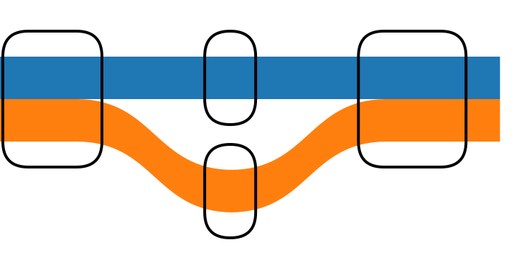

# @jbrowse/tubemap-core

sequenceTubeMap's layout: graph nodes and paths (and reads) in, tube map shapes
out. No DOM, d3 or React.

```sh
pnpm add @jbrowse/tubemap-core
```

Versions 0.1.0 and 0.2.0 also went out as `@gmod/tubemap-core`, which is
deprecated; install this name instead.

```ts
import { layoutTubeMap } from '@jbrowse/tubemap-core'

const layout = layoutTubeMap(
  [
    { name: '1', seq: 'ACGT' },
    { name: '2', seq: 'A' },
    { name: '3', seq: 'G' },
    { name: '4', seq: 'TTGCA' },
  ],
  [
    { id: 0, name: 'ref', sequence: ['1', '2', '4'], sourceTrackID: 0 },
    { id: 1, name: 'alt', sequence: ['1', '3', '4'], sourceTrackID: 0 },
  ],
  [], // reads
  { nodeWidthOption: 'compressed' },
)
```

- Track 0 is the reference; `-name` is a reverse visit
- A node without `seq` needs `sequenceLength`

## What `layoutTubeMap` returns

A `TubeMapLayout`, or `undefined` when no visible track is left. Every
coordinate is in layout pixels, x rightward and y downward, so a renderer needs
no further math.

| Field                            | Holds                                                                                                                                                                                               |
| -------------------------------- | --------------------------------------------------------------------------------------------------------------------------------------------------------------------------------------------------- |
| `shapes`                         | What to draw: `rectangles` (straight tube segments), `curves` (tubes changing lane between nodes), `corners` and `verticalRectangles` (inversions). Each shape has coordinates and its track's `id` |
| `nodes`                          | The placed nodes, with `x`, `y`, `pixelWidth`, `contentHeight`, `order` and the `tracks` through each. Indexed from 1, with a hole at 0                                                             |
| `tracks`                         | The haplotype tracks and placed reads, each with its `path` and `width`. A shape finds its track by `id`                                                                                            |
| `reads`                          | The placed reads alone                                                                                                                                                                              |
| `bounds`                         | `{ minX, maxX, minY, maxY }` around everything drawn; size the SVG `viewBox` from it                                                                                                                |
| `nodeMap`                        | Node name to index in `nodes`                                                                                                                                                                       |
| `maxOrder`, `trackForRuler`      | The count of horizontal order slots, and the name of the track that carries coordinates for a ruler                                                                                                 |
| `coarsened`, `coarsenedEdgeMeta` | What each banded layer drew and the label of every band; both are empty without `layers` or `coarsenedReadView`                                                                                     |

For the example above:

```ts
layout.bounds
// { minX: 20, maxX: 185.57, minY: 10, maxY: 85 }

layout.nodes[1]
// { name: '1', seq: 'ACGT', x: 20, y: 20, pixelWidth: 17, contentHeight: 30,
//   order: 0, tracks: [0, 1], successors: [2, 3], ... }

layout.shapes.rectangles[0]
// { xStart: 0, yStart: 35, xEnd: 37, yEnd: 49, id: 1, name: 'alt',
//   type: 'haplotype' }
```

- Shapes carry no color: each names its track's `id`, and the caller colors it
  from the matching track in `layout.tracks`, so a recolor needs no new layout
- `layout.nodes` has a hole at index 0: use `forEach` or `filter`, not
  `for...of` or `find`

### Drawing the layout

`curvePaths(curves, type)` fills in each curve's SVG `path`, and
`nodeOutlinePath(node)` returns a node's box as path data (`new Path2D(d)` on a
canvas). Together they are enough to draw the example as SVG:

```ts
import { curvePaths, nodeOutlinePath } from '@jbrowse/tubemap-core'

const colors = ['#1f77b4', '#ff7f0e'] // by track id
const { minX, maxX, minY, maxY } = layout.bounds
const parts: string[] = []
for (const r of layout.shapes.rectangles) {
  const w = r.xEnd - r.xStart + 1
  const h = r.yEnd - r.yStart + 1
  parts.push(
    `<rect x="${r.xStart}" y="${r.yStart}" width="${w}" height="${h}" fill="${colors[r.id]}"/>`,
  )
}
for (const c of curvePaths(layout.shapes.curves, 'haplotype')) {
  parts.push(`<path d="${c.path}" fill="${colors[c.id]}"/>`)
}
layout.nodes.forEach(node => {
  parts.push(`<path d="${nodeOutlinePath(node)}" fill="none" stroke="black"/>`)
})
const svg = `<svg xmlns="http://www.w3.org/2000/svg"
  viewBox="${minX - 10} ${minY - 10} ${maxX - minX + 20} ${maxY - minY + 20}">
  ${parts.join('')}</svg>`
```



Reads go in the third argument and draw the same way: their shapes have
`type: 'read'`, so call `curvePaths(layout.shapes.curves, 'read')` for their
curves.

## Topology and placement

`layoutTubeMap` runs two phases, also exported for running one topology under
several placements:

```ts
const topology = layoutTopology(nodes, tracks, reads, topologyOptions)
const all = placeTubeMap(topology)
const confident = placeTubeMap(topology, { mappingQualityCutoff: 30 })
```

- `layoutTopology` merges, orders, orients and sizes the nodes under the visible
  tracks and every primary read, and fixes each node's x from placing them all
- `placeTubeMap` lays out the haplotypes and the reads its options keep at the
  topology's x positions, so every placement of one topology lines up
- Read filters never move a node; one only a filtered-out read visits keeps its
  place, drawn empty

## Facets

`placeFacets` places one topology once per subset and stacks the panels, each
with an `offsetY`, at the topology's x:

```ts
const { panels, bounds } = placeFacets(topology, { facetBy: 'sample_name' })
```

- `facetBy`: `read_group` or `sample_name` splits the reads and repeats every
  haplotype in each panel; `haplotype_sample` splits the haplotypes by the
  sample in their PanSN names (`parsePanSN`), each panel keeping the reference,
  and draws the reads in a last panel
- `PlacementOptions.facet` places one panel alone, as `placeTubeMap` does
- Without `facetBy`, or with nothing to split, `panels` holds one panel of
  `placeTubeMap`'s layout

## Options

- `nodeWidthOption`: `normal` (default), `compressed`, `small`, `fixed`
- `charWidth`: px per base under `normal` (8.401)
- `trackWidth`: tube width (15)
- `mergeNodes`, `showReads` (true); `coarsenedReadView`, `ignoreStrand` (false)
- `layers`: the track sets placement draws, each with an optional stat.
  `{ data: 'haplotypes', stat: 'coarsen' }` bands every haplotype but the
  reference, one band per edge, and `{ data: 'reads', stat: 'coarsen' }` does
  the same for the reads, which stack under the haplotypes either way. Unset,
  `coarsenedReadView` bands the reads, or the haplotypes when no reads load
- `mappingQualityCutoff`, `focusReadNames`: read filters, the only placement
  options; the rest belong to the topology

`layout.coarsened` holds a `Coarsening` per banded layer, and
`layout.coarsenedEdgeMeta` labels every band by its id, which no two bands
share.

## Development

```sh
pnpm install
pnpm lint
pnpm format:check
pnpm typecheck
pnpm build
pnpm test --run
pnpm test:pack
```

`test/layout.golden.test.ts` pins every shape and node position for the
sequenceTubeMap demo examples and a few bundled graphs, under each option that
picks a different layout path. Its inputs in `test/fixtures` are the nodes,
tracks and reads the viewer hands the layout, and
`scripts/dump-viewer-fixtures.ts` regenerates them from a viewer checkout. After
an intended layout change, `pnpm test --run -u test/layout.golden.test.ts`
rewrites the goldens in `test/layout-golden`.

`CHANGELOG.md` lists the changes in each version.

## Releasing

- `pnpm version <patch|minor|major>` runs the CI checks, bumps `version`, writes
  the changelog with git-cliff, tags `v<version>` and pushes the tag
- `.github/workflows/publish.yml` checks that the tag names the package version,
  tests, and publishes to npm with provenance under trusted publishing, which
  needs no stored token
- A GitHub release follows, its notes taken from `CHANGELOG.md`

## License

MIT

## Footnote

Derived from https://github.com/vgteam/sequenceTubeMap and carries original
copywrite in MIT license form

Used in our MemPanG tube map https://github.com/cmdcolin/sequenceTubeMap
